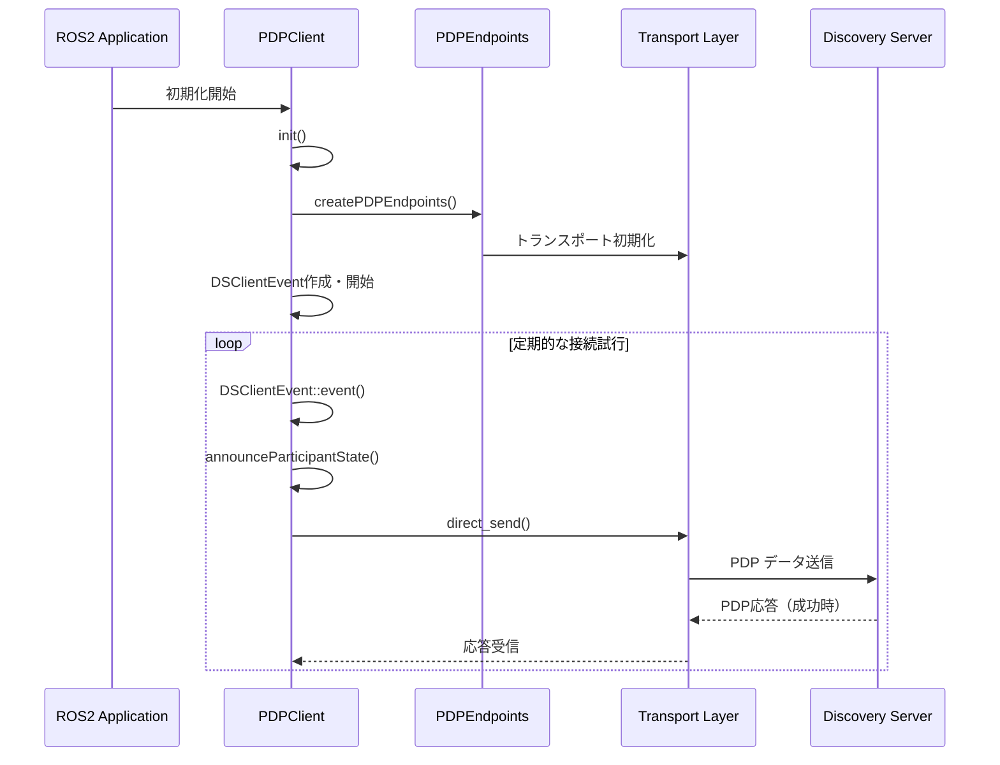
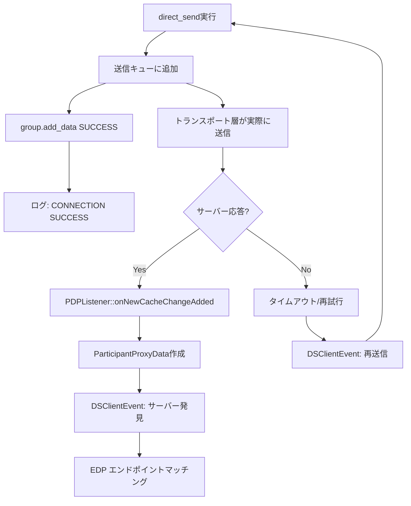

# Fast-DDS Discovery Server 包括的分析

## 概要

Fast-DDS 2.14.4における Discovery Server の動作メカニズム、接続シーケンス、フォールバック条件、および接続監視機能の実装について包括的に解説します。本ドキュメントは実際の調査・実装結果に基づく技術資料です。

## 目次

1. [Discovery Server フォールバック条件調査](#discovery-server-フォールバック条件調査)
2. [接続シーケンスと実装詳細](#接続シーケンスと実装詳細)
3. [接続監視機能の実装](#接続監視機能の実装)
4. [トラブルシューティングガイド](#トラブルシューティングガイド)

---

## Discovery Server フォールバック条件調査

### 調査目的

Fast-DDS が Discovery Server クライアントモードから Simple Discovery（マルチキャスト）モードにフォールバックする正確な条件を特定する。

### 調査手法

#### 実装した調査ログ

1. **Discovery Method Decision Log** (`src/cpp/rtps/builtin/BuiltinProtocols.cpp`)
```cpp
std::cout << "[INVESTIGATION] DiscoveryProtocol decision: ";
switch (m_att.discovery_config.discoveryProtocol)
{
    case DiscoveryProtocol_t::SIMPLE:
        std::cout << "SIMPLE (PDPSimple will be used)" << std::endl;
        break;
    case DiscoveryProtocol_t::CLIENT:
        std::cout << "CLIENT (PDPClient will be used)" << std::endl;
        break;
    // ...
}
```

2. **Fallback Detection Log** (`src/cpp/rtps/builtin/discovery/participant/PDPSimple.cpp`)
```cpp
const char* discovery_server = std::getenv("ROS_DISCOVERY_SERVER");
if (discovery_server != nullptr)
{
    std::cout << "[WARNING] [RTPS_PDP_CLIENT]: DISCOVERY SERVER FALLBACK DETECTED - "
             << "Configured server " << discovery_server 
             << " not reachable, falling back to multicast discovery" << std::endl;
}
```

### テスト結果サマリー

| ケース | 環境変数 | Discovery メソッド | 実際の動作 | フォールバック警告 |
|------|---------------------|------------------|-----------------|------------------|
| 1 | 未設定 | **SIMPLE** | PDPSimple | ❌ |
| 2 | `127.0.0.1:11811` | **CLIENT** | PDPClient (1 locator) | ❌ |
| 3 | Reset→Reset | **CLIENT** | PDPClient (1 locator) | ❌ |
| 4 | `127.0.0.1:99999` | **CLIENT** | PDPClient (0 locators) | ❌ |
| 5 | `invalid` | **CLIENT** | PDPClient (0 locators) | ❌ |
| 6 | `""` (空文字列) | **SIMPLE** | PDPSimple | ✅ |
| 7 | `127.0.0.1:11811;127.0.0.1:11812` | **CLIENT** | PDPClient (2 locators) | ❌ |

### 主要な発見

#### 1. フォールバック条件の特定

**唯一のフォールバック条件**: `ROS_DISCOVERY_SERVER=""` (空文字列)

- フォールバック警告は テストケース6 でのみ出力
- 警告メッセージ: `DISCOVERY SERVER FALLBACK DETECTED - Configured server  not reachable, falling back to multicast discovery`

#### 2. Discovery メソッド選択ルール

```
ROS_DISCOVERY_SERVER 環境変数の状態分岐:
├─ 未設定 → SIMPLE (通常のマルチキャスト)
├─ 空文字列 ("") → SIMPLE + フォールバック警告
├─ 有効形式 (IP:PORT) → CLIENT (通常送信)
├─ 無効形式 (invalid) → CLIENT (0 locators で送信)
└─ 無効ポート (>65535) → CLIENT (0 locators で送信)
```

#### 3. 動的フォールバックは存在しない

調査結果により判明:

- **PDPClient → PDPSimple への動的切り替えは実装されていない**
- Discovery メソッドは起動時の `clientServerEnvironmentCreationOverride()` でのみ決定
- `BuiltinProtocols::initBuiltinProtocols()` で PDP クラスが決定されると変更されない

---

## 接続シーケンスと実装詳細

### 全体アーキテクチャ



### 詳細な接続シーケンス

#### 1. 初期化フェーズ（PDPClient::init()）

**ファイル**: `src/cpp/rtps/builtin/discovery/participant/PDPClient.cpp:199-235`

```cpp
bool PDPClient::init(RTPSParticipantImpl* part) {
    // 1. 基本PDP初期化
    if (!PDP::initPDP(part)) return false;
    
    // 2. EDPClient作成（エンドポイント発見用）
    mp_EDP = new EDPClient(this, mp_RTPSParticipant);
    if (!mp_EDP->initEDP(m_discovery)) return false;
    
    // 3. 定期同期イベント作成・開始
    mp_sync = new DSClientEvent(this, syncperiod);
    mp_sync->restart_timer();
    
    // 4. 【新機能】初期疎通確認ログ
    if (is_connection_logging_enabled()) {
        // Discovery Serverリストを確認してログ出力
    }
    
    return true;
}
```

#### 2. 定期接続試行フェーズ（DSClientEvent）

**ファイル**: `src/cpp/rtps/builtin/discovery/participant/timedevent/DSClientEvent.cpp:56-100`

```cpp
bool DSClientEvent::event() {
    bool restart = false;
    
    // 各Discovery Serverをチェック
    for (auto server : mp_PDP->remote_server_attributes()) {
        ParticipantProxyData* part_proxy_data = 
            mp_PDP->get_participant_proxy_data(server.guidPrefix);
            
        if (part_proxy_data != nullptr) {
            // サーバーが既知 = 接続済み
            // EDPエンドポイントのマッチング
            if (!mp_EDP->areRemoteEndpointsMatched(part_proxy_data)) {
                mp_EDP->assignRemoteEndpoints(*part_proxy_data, true);
            }
        } else {
            // サーバーが未知 = 接続が必要
            restart = true;
        }
    }
    
    // 未接続サーバーがあれば再送信
    if (restart) {
        mp_PDP->_serverPing = true;
        mp_PDP->announceParticipantState(false, false, wp);
    }
    
    return restart; // true = タイマー継続
}
```

#### 3. トランスポート送信フェーズ（direct_send）

**ファイル**: `src/cpp/rtps/builtin/discovery/participant/PDPClient.cpp:63-116`

```cpp
static void direct_send(RTPSParticipantImpl* participant,
                       LocatorList& locators,
                       std::vector<GUID_t>& remote_readers,
                       const CacheChange_t& change,
                       fastrtps::rtps::Endpoint& sender_endpt) {
    
    // 【新機能】設定エラー検出
    if (locators.empty() && is_connection_logging_enabled()) {
        const char* discovery_server = std::getenv("ROS_DISCOVERY_SERVER");
        if (discovery_server && strlen(discovery_server) > 0) {
            EPROSIMA_LOG_ERROR(RTPS_PDP_CLIENT, 
                "DISCOVERY SERVER CONFIG INVALID - Server parsing failed for: " << discovery_server);
        }
    }
    
    // 1. DirectMessageSender作成
    DirectMessageSender sender(participant, &remote_readers, &locators);
    RTPSMessageGroup group(participant, &sender_endpt, &sender);
    
    // 2. データの送信キューへの追加
    bool success = group.add_data(change, false);
    
    // 3. 【新機能】送信結果のログ出力
    for (const auto& locator : locators) {
        if (!success) {
            EPROSIMA_LOG_ERROR(RTPS_PDP_CLIENT, 
                "DISCOVERY SERVER SEND FAILED - Cannot reach server at " << locator);
        } else {
            if (is_connection_logging_enabled()) {
                EPROSIMA_LOG_INFO(RTPS_PDP_CLIENT, 
                    "DISCOVERY SERVER CONNECTION SUCCESS - Data sent successfully to server at " << locator);
            }
        }
    }
}
```

### 非同期処理の流れ



---

## 接続監視機能の実装

### 実装された機能

#### 1. 初期疎通確認ログ
```
DISCOVERY SERVER INITIAL CHECK - Will attempt connection to server at UDPv4:[127.0.0.1]:11811
```

#### 2. 接続成功ログ
```
DISCOVERY SERVER CONNECTION SUCCESS - Data sent successfully to server at UDPv4:[127.0.0.1]:11811
```

#### 3. 設定エラー検出ログ
```
DISCOVERY SERVER CONFIG INVALID - Server parsing failed for: 127.0.0.1:99999
```

### 制御方法

```bash
export FASTDDS_CONNECTION_LOGGING=1  # ログ有効化
export FASTDDS_CONNECTION_LOGGING=0  # ログ無効化
```

### 実装ファイル

- `src/cpp/utils/connection_logging.cpp` - ログ制御機能
- `src/cpp/rtps/builtin/discovery/participant/PDPClient.cpp` - メイン実装

### TCP vs UDP の実装差異

#### Discovery Server設定例

**UDP設定**:
```bash
export ROS_DISCOVERY_SERVER="127.0.0.1:11811"
fast-discovery-server -i 0 -l 127.0.0.1 -p 11811
```

**TCP設定**:
```bash
export ROS_DISCOVERY_SERVER="TCPv4:[127.0.0.1]:42100"
fast-discovery-server -i 0 -t 127.0.0.1 -q 42100
```

#### 接続判定の限界

**現在の実装での制限**:
1. **`group.add_data()`の戻り値**:
   - ✅ **成功**: メッセージが送信キューに追加された
   - ❌ **意味しないもの**: 実際にサーバーに届いたか
   - ❌ **意味しないもの**: サーバーが応答したか

2. **UDP/TCP共通の課題**:
   - UDPは接続レスプロトコル（送信は常に「成功」）
   - TCPも非同期接続で送信キューへの追加のみを判定
   - 実際の接続確認には時間がかかる

---

## トラブルシューティングガイド

### 問題の特定方法

#### 1. Discovery メソッドの確認
```bash
# ログで確認
[INVESTIGATION] DiscoveryProtocol decision: CLIENT (PDPClient will be used)
# または
[INVESTIGATION] DiscoveryProtocol decision: SIMPLE (PDPSimple will be used)
```

#### 2. 設定エラーの確認
```bash
# 無効ポート
export ROS_DISCOVERY_SERVER="127.0.0.1:99999"
# → DISCOVERY SERVER CONFIG INVALID ログ

# 無効形式
export ROS_DISCOVERY_SERVER="invalid"
# → 0 locators で動作
```

#### 3. 接続状況の監視
```bash
export FASTDDS_CONNECTION_LOGGING=1
# → 接続試行と結果をリアルタイムで確認
```

### よくある問題と解決方法

#### 問題1: Discovery Server が見つからない
**症状**: CLIENT モードだが通信できない
**確認**: 
```bash
# サーバーが起動しているか確認
netstat -ln | grep :11811
```
**解決**: Discovery Server を起動

#### 問題2: 設定ミス
**症状**: CONFIG INVALID ログが出力
**確認**: 環境変数の形式をチェック
**解決**: 正しい形式で設定
```bash
# 正しい例
export ROS_DISCOVERY_SERVER="127.0.0.1:11811"
export ROS_DISCOVERY_SERVER="TCPv4:[127.0.0.1]:42100"
```

#### 問題3: フォールバック状況
**症状**: FALLBACK DETECTED ログが出力
**原因**: 空文字列設定
**解決**: 
```bash
# 正しい設定
export ROS_DISCOVERY_SERVER="127.0.0.1:11811"
# または環境変数を削除
unset ROS_DISCOVERY_SERVER
```

### Phase 2 改善提案

#### 必要な機能拡張
1. **ParticipantProxyData**の存在確認による真の接続状態監視
2. **DSClientEvent**のタイムアウト監視機能
3. **トランスポート層**の接続状態確認機能
4. **初期疎通確認**でのTCP接続テスト

#### 技術的課題
- Fast-DDSの非同期アーキテクチャ
- トランスポート層の抽象化
- 既存コードへの影響最小化

---

## 関連ファイル

### 主要実装ファイル
- `src/cpp/rtps/builtin/discovery/participant/PDPClient.cpp` - メイン実装
- `src/cpp/rtps/builtin/discovery/participant/PDPClient.h` - クラス定義
- `src/cpp/rtps/builtin/discovery/participant/timedevent/DSClientEvent.cpp` - 定期イベント
- `src/cpp/utils/connection_logging.cpp` - ログ制御機能
- `src/cpp/rtps/builtin/BuiltinProtocols.cpp` - Discovery メソッド選択
- `src/cpp/rtps/builtin/discovery/participant/PDPSimple.cpp` - フォールバック検出

### 設定・制御
- 環境変数: `ROS_DISCOVERY_SERVER`, `FASTDDS_CONNECTION_LOGGING`
- XMLプロファイル: TCP/UDP設定サポート

---

**作成日**: 2025年7月30日  
**調査・実装対象**: Fast-DDS 2.14.4  
**ROS 2 Version**: Jazzy  
**目的**: Discovery Server 動作メカニズムの包括的理解と接続監視機能実装