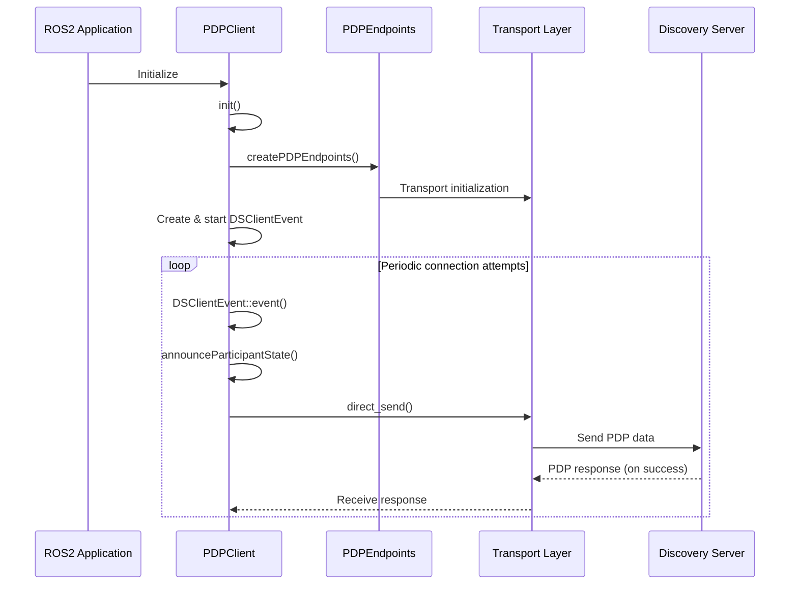
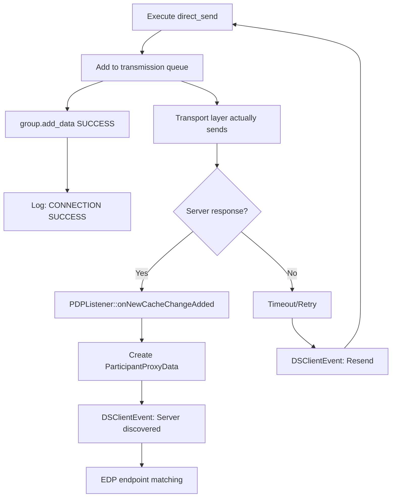

# Fast-DDS Discovery Server Comprehensive Analysis

## Overview

This document provides a comprehensive analysis of Fast-DDS 2.14.4 Discovery Server operation mechanisms, connection sequences, fallback conditions, and connection monitoring feature implementation. This technical documentation is based on actual investigation and implementation results.

## Table of Contents

1. [Discovery Server Fallback Condition Investigation](#discovery-server-fallback-condition-investigation)
2. [Connection Sequence and Implementation Details](#connection-sequence-and-implementation-details)
3. [Connection Monitoring Feature Implementation](#connection-monitoring-feature-implementation)
4. [Troubleshooting Guide](#troubleshooting-guide)

---

## Discovery Server Fallback Condition Investigation

### Investigation Objective

Determine the exact conditions under which Fast-DDS falls back from Discovery Server client mode to Simple Discovery (multicast) mode.

### Investigation Method

#### Implemented Investigation Logs

1. **Discovery Method Decision Log** (`src/cpp/rtps/builtin/BuiltinProtocols.cpp`)
```cpp
std::cout << "[INVESTIGATION] DiscoveryProtocol decision: ";
switch (m_att.discovery_config.discoveryProtocol)
{
    case DiscoveryProtocol_t::SIMPLE:
        std::cout << "SIMPLE (PDPSimple will be used)" << std::endl;
        break;
    case DiscoveryProtocol_t::CLIENT:
        std::cout << "CLIENT (PDPClient will be used)" << std::endl;
        break;
    // ...
}
```

2. **Fallback Detection Log** (`src/cpp/rtps/builtin/discovery/participant/PDPSimple.cpp`)
```cpp
const char* discovery_server = std::getenv("ROS_DISCOVERY_SERVER");
if (discovery_server != nullptr)
{
    std::cout << "[WARNING] [RTPS_PDP_CLIENT]: DISCOVERY SERVER FALLBACK DETECTED - "
             << "Configured server " << discovery_server 
             << " not reachable, falling back to multicast discovery" << std::endl;
}
```

### Test Results Summary

| Case | Environment Variable | Discovery Method | Actual Behavior | Fallback Warning |
|------|---------------------|------------------|-----------------|------------------|
| 1 | Unset | **SIMPLE** | PDPSimple | ❌ |
| 2 | `127.0.0.1:11811` | **CLIENT** | PDPClient (1 locator) | ❌ |
| 3 | Reset→Reset | **CLIENT** | PDPClient (1 locator) | ❌ |
| 4 | `127.0.0.1:99999` | **CLIENT** | PDPClient (0 locators) | ❌ |
| 5 | `invalid` | **CLIENT** | PDPClient (0 locators) | ❌ |
| 6 | `""` (empty string) | **SIMPLE** | PDPSimple | ✅ |
| 7 | `127.0.0.1:11811;127.0.0.1:11812` | **CLIENT** | PDPClient (2 locators) | ❌ |

### Key Findings

#### 1. Fallback Condition Identification

**Only fallback condition**: `ROS_DISCOVERY_SERVER=""` (empty string)

- Fallback warning was only output in test case 6
- Warning message: `DISCOVERY SERVER FALLBACK DETECTED - Configured server  not reachable, falling back to multicast discovery`

#### 2. Discovery Method Selection Rules

```
ROS_DISCOVERY_SERVER environment variable state branching:
├─ Unset → SIMPLE (normal multicast)
├─ Empty string ("") → SIMPLE + fallback warning
├─ Valid format (IP:PORT) → CLIENT (normal transmission)
├─ Invalid format (invalid) → CLIENT (transmission with 0 locators)
└─ Invalid port (>65535) → CLIENT (transmission with 0 locators)
```

#### 3. No Dynamic Fallback Exists

Investigation results revealed:

- **No dynamic switching from PDPClient → PDPSimple is implemented**
- Discovery method is determined only at startup by `clientServerEnvironmentCreationOverride()`
- Once PDP class is determined in `BuiltinProtocols::initBuiltinProtocols()`, it never changes

---

## Connection Sequence and Implementation Details

### Overall Architecture



### Detailed Connection Sequence

#### 1. Initialization Phase (PDPClient::init())

**File**: `src/cpp/rtps/builtin/discovery/participant/PDPClient.cpp:199-235`

```cpp
bool PDPClient::init(RTPSParticipantImpl* part) {
    // 1. Basic PDP initialization
    if (!PDP::initPDP(part)) return false;
    
    // 2. Create EDPClient (for endpoint discovery)
    mp_EDP = new EDPClient(this, mp_RTPSParticipant);
    if (!mp_EDP->initEDP(m_discovery)) return false;
    
    // 3. Create and start periodic sync event
    mp_sync = new DSClientEvent(this, syncperiod);
    mp_sync->restart_timer();
    
    // 4. [NEW FEATURE] Initial connectivity check log
    if (is_connection_logging_enabled()) {
        // Check Discovery Server list and output logs
    }
    
    return true;
}
```

#### 2. Periodic Connection Attempt Phase (DSClientEvent)

**File**: `src/cpp/rtps/builtin/discovery/participant/timedevent/DSClientEvent.cpp:56-100`

```cpp
bool DSClientEvent::event() {
    bool restart = false;
    
    // Check each Discovery Server
    for (auto server : mp_PDP->remote_server_attributes()) {
        ParticipantProxyData* part_proxy_data = 
            mp_PDP->get_participant_proxy_data(server.guidPrefix);
            
        if (part_proxy_data != nullptr) {
            // Server is known = connected
            // Match EDP endpoints
            if (!mp_EDP->areRemoteEndpointsMatched(part_proxy_data)) {
                mp_EDP->assignRemoteEndpoints(*part_proxy_data, true);
            }
        } else {
            // Server is unknown = connection needed
            restart = true;
        }
    }
    
    // Resend if there are unconnected servers
    if (restart) {
        mp_PDP->_serverPing = true;
        mp_PDP->announceParticipantState(false, false, wp);
    }
    
    return restart; // true = continue timer
}
```

#### 3. Transport Transmission Phase (direct_send)

**File**: `src/cpp/rtps/builtin/discovery/participant/PDPClient.cpp:63-116`

```cpp
static void direct_send(RTPSParticipantImpl* participant,
                       LocatorList& locators,
                       std::vector<GUID_t>& remote_readers,
                       const CacheChange_t& change,
                       fastrtps::rtps::Endpoint& sender_endpt) {
    
    // [NEW FEATURE] Configuration error detection
    if (locators.empty() && is_connection_logging_enabled()) {
        const char* discovery_server = std::getenv("ROS_DISCOVERY_SERVER");
        if (discovery_server && strlen(discovery_server) > 0) {
            EPROSIMA_LOG_ERROR(RTPS_PDP_CLIENT, 
                "DISCOVERY SERVER CONFIG INVALID - Server parsing failed for: " << discovery_server);
        }
    }
    
    // 1. Create DirectMessageSender
    DirectMessageSender sender(participant, &remote_readers, &locators);
    RTPSMessageGroup group(participant, &sender_endpt, &sender);
    
    // 2. Add data to transmission queue
    bool success = group.add_data(change, false);
    
    // 3. [NEW FEATURE] Log transmission results
    for (const auto& locator : locators) {
        if (!success) {
            EPROSIMA_LOG_ERROR(RTPS_PDP_CLIENT, 
                "DISCOVERY SERVER SEND FAILED - Cannot reach server at " << locator);
        } else {
            if (is_connection_logging_enabled()) {
                EPROSIMA_LOG_INFO(RTPS_PDP_CLIENT, 
                    "DISCOVERY SERVER CONNECTION SUCCESS - Data sent successfully to server at " << locator);
            }
        }
    }
}
```

### Asynchronous Processing Flow



---

## Connection Monitoring Feature Implementation

### Implemented Features

#### 1. Initial Connectivity Check Log
```
DISCOVERY SERVER INITIAL CHECK - Will attempt connection to server at UDPv4:[127.0.0.1]:11811
```

#### 2. Connection Success Log
```
DISCOVERY SERVER CONNECTION SUCCESS - Data sent successfully to server at UDPv4:[127.0.0.1]:11811
```

#### 3. Configuration Error Detection Log
```
DISCOVERY SERVER CONFIG INVALID - Server parsing failed for: 127.0.0.1:99999
```

### Control Method

```bash
export FASTDDS_CONNECTION_LOGGING=1  # Enable logging
export FASTDDS_CONNECTION_LOGGING=0  # Disable logging
```

### Implementation Files

- `src/cpp/utils/connection_logging.cpp` - Log control functionality
- `src/cpp/rtps/builtin/discovery/participant/PDPClient.cpp` - Main implementation

### TCP vs UDP Implementation Differences

#### Discovery Server Configuration Examples

**UDP Configuration**:
```bash
export ROS_DISCOVERY_SERVER="127.0.0.1:11811"
fast-discovery-server -i 0 -l 127.0.0.1 -p 11811
```

**TCP Configuration**:
```bash
export ROS_DISCOVERY_SERVER="TCPv4:[127.0.0.1]:42100"
fast-discovery-server -i 0 -t 127.0.0.1 -q 42100
```

#### Connection Determination Limitations

**Current Implementation Limitations**:
1. **`group.add_data()` return value**:
   - ✅ **Success**: Message was added to transmission queue
   - ❌ **Does NOT mean**: Message actually reached the server
   - ❌ **Does NOT mean**: Server responded

2. **Common UDP/TCP Issues**:
   - UDP is connectionless protocol (transmission always "succeeds")
   - TCP also uses asynchronous connections, only judging addition to transmission queue
   - Actual connection verification takes time

---

## Troubleshooting Guide

### Problem Identification Methods

#### 1. Verify Discovery Method
```bash
# Check in logs
[INVESTIGATION] DiscoveryProtocol decision: CLIENT (PDPClient will be used)
# or
[INVESTIGATION] DiscoveryProtocol decision: SIMPLE (PDPSimple will be used)
```

#### 2. Check Configuration Errors
```bash
# Invalid port
export ROS_DISCOVERY_SERVER="127.0.0.1:99999"
# → DISCOVERY SERVER CONFIG INVALID log

# Invalid format
export ROS_DISCOVERY_SERVER="invalid"
# → Operates with 0 locators
```

#### 3. Monitor Connection Status
```bash
export FASTDDS_CONNECTION_LOGGING=1
# → Real-time monitoring of connection attempts and results
```

### Common Problems and Solutions

#### Problem 1: Discovery Server Not Found
**Symptoms**: CLIENT mode but cannot communicate
**Check**: 
```bash
# Verify if server is running
netstat -ln | grep :11811
```
**Solution**: Start Discovery Server

#### Problem 2: Configuration Mistake
**Symptoms**: CONFIG INVALID log output
**Check**: Verify environment variable format
**Solution**: Set with correct format
```bash
# Correct examples
export ROS_DISCOVERY_SERVER="127.0.0.1:11811"
export ROS_DISCOVERY_SERVER="TCPv4:[127.0.0.1]:42100"
```

#### Problem 3: Fallback Situation
**Symptoms**: FALLBACK DETECTED log output
**Cause**: Empty string configuration
**Solution**: 
```bash
# Correct configuration
export ROS_DISCOVERY_SERVER="127.0.0.1:11811"
# or remove environment variable
unset ROS_DISCOVERY_SERVER
```

### Phase 2 Improvement Proposals

#### Required Feature Extensions
1. True connection state monitoring via **ParticipantProxyData** existence verification
2. **DSClientEvent** timeout monitoring functionality
3. **Transport layer** connection state verification functionality
4. TCP connection testing in **initial connectivity check**

#### Technical Challenges
- Fast-DDS asynchronous architecture
- Transport layer abstraction
- Minimizing impact on existing code

---

## Related Files

### Main Implementation Files
- `src/cpp/rtps/builtin/discovery/participant/PDPClient.cpp` - Main implementation
- `src/cpp/rtps/builtin/discovery/participant/PDPClient.h` - Class definition
- `src/cpp/rtps/builtin/discovery/participant/timedevent/DSClientEvent.cpp` - Periodic events
- `src/cpp/utils/connection_logging.cpp` - Log control functionality
- `src/cpp/rtps/builtin/BuiltinProtocols.cpp` - Discovery method selection
- `src/cpp/rtps/builtin/discovery/participant/PDPSimple.cpp` - Fallback detection

### Configuration & Control
- Environment variables: `ROS_DISCOVERY_SERVER`, `FASTDDS_CONNECTION_LOGGING`
- XML profiles: TCP/UDP configuration support

---

**Created**: July 30, 2025  
**Investigation & Implementation Target**: Fast-DDS 2.14.4  
**ROS 2 Version**: Jazzy  
**Purpose**: Comprehensive understanding of Discovery Server operation mechanisms and connection monitoring feature implementation